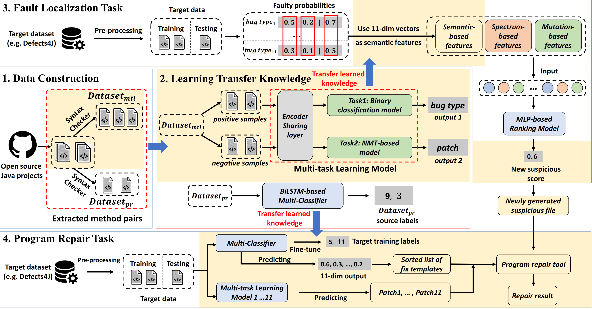

# MTL-TRANSFER

I. Overview of MTL-TRANSFER
--------------------

II. Download Dataset
--------------------

Download data from : https://mega.nz/folder/7vpmFLRY#mI58y8YVk0fLnkA8ISQE7A
TRANSFER github: https://github.com/mxx1219/TRANSFER

III. Prepare Defects4J Bugs
---------------------------
 1. Download and install [Defects4J 1.2.0](https://github.com/rjust/defects4j/releases/tag/v1.2.0), and complete the requirements in their README file.
 
 2. Export environment variable `D4J_HOME` as the root dir of Defects4j.

IV. Get Experimental Results In FL Task
  --------------------------
 1. Process data: run `./data_process/data_prepare.py`, `./data_process/data_tokenizer.py`,`./data_process/data_gen.py`,`./data_process/data2pkl.py`,`./data_process/data_process.py` for Dataset_mtl, Dataset_pr and Defects4J Data.
 2. Run multi-task learning model: `./fault_localization/MTL_model/train/train_InsertMissedStmt.py` 11 model files.
 3. Run for semantic file: run `./fault_localization/FL/data_preprocess_for_d4j_new.py`, `./fault_localization/FL/predict_for_d4j.py`
 4. Run for FL task result: run
 `./fault_localization/FL/ranking_task/gen_data_new.py`, `./fault_localization/FL/ranking_task/run_model/run_group.py`

V. Get Experimental Results In APR Task
  --------------------------
 1. Train the multi-classifier: run `./program_repair/template_selection/pipeline.py`, `./program_repair/template_selection/train_d4j.py` 
 2. Run for APR task: run `./program_repair/APR/run_shell/generate_shell.py`, `./program_repair/APR/run_shell/gen_ssh_run_NFL.py`, `./program_repair/APR/run_shell/run_repair.sh`
